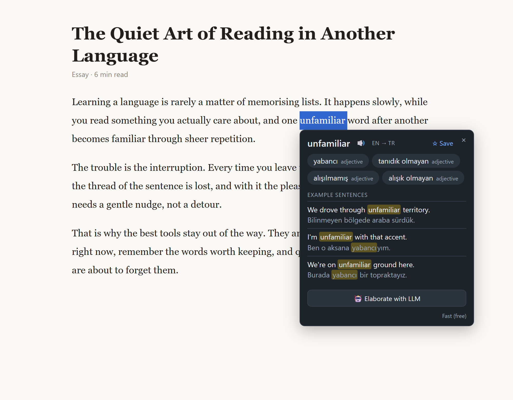
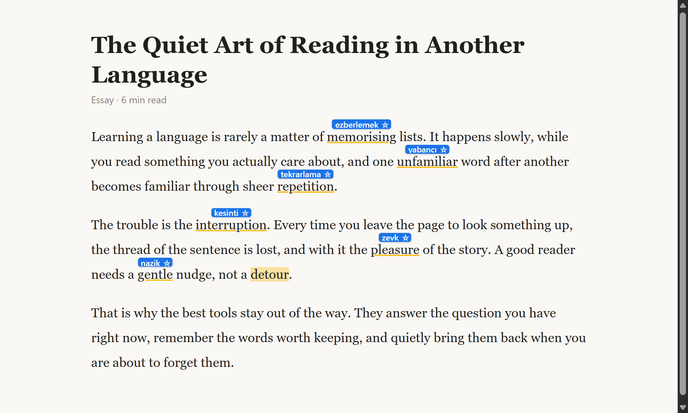
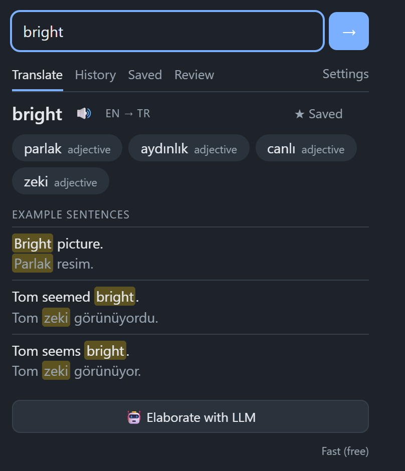
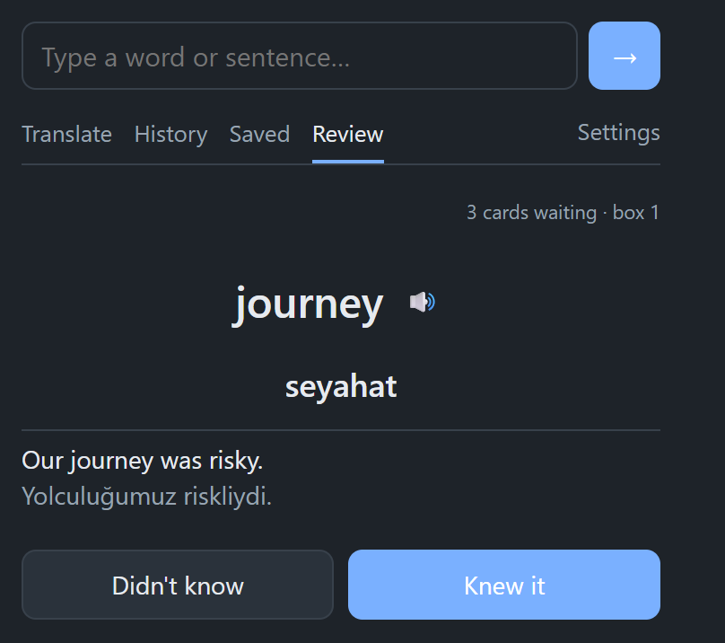
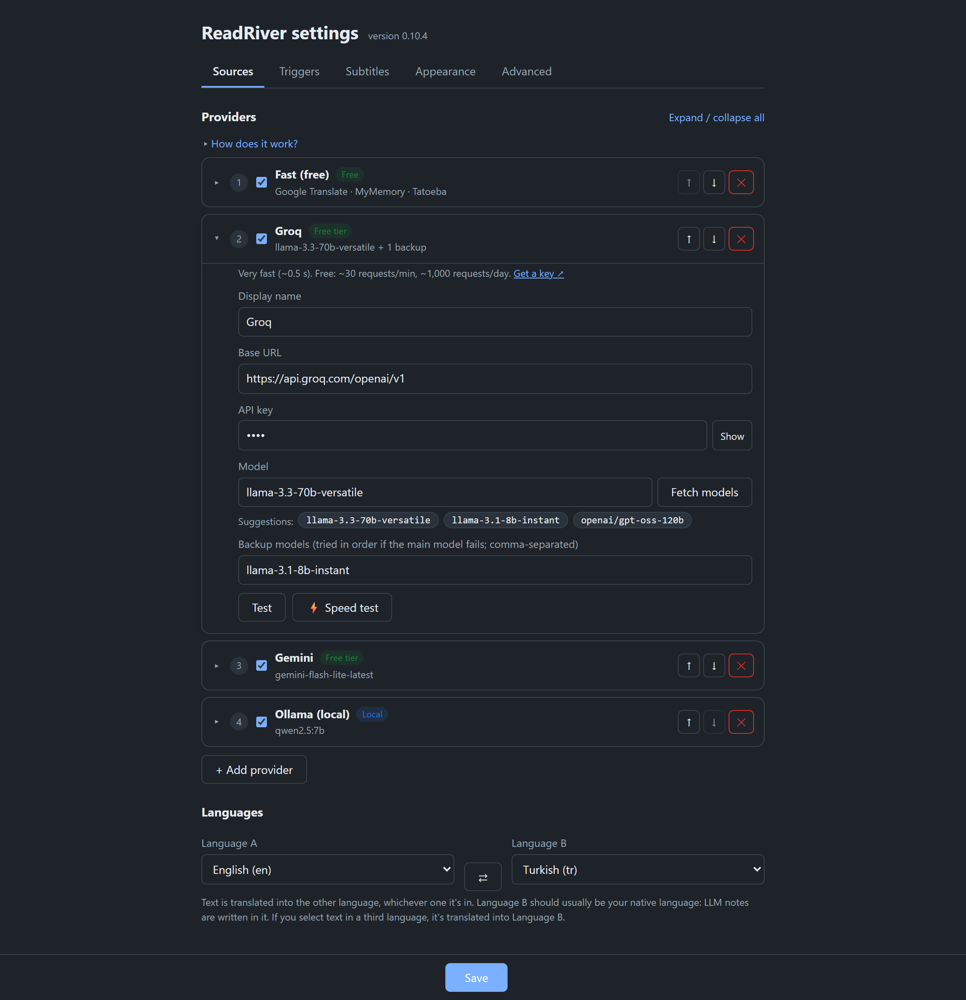
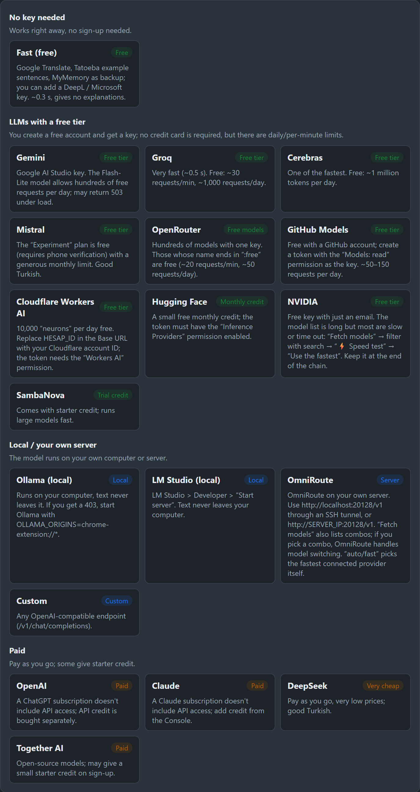
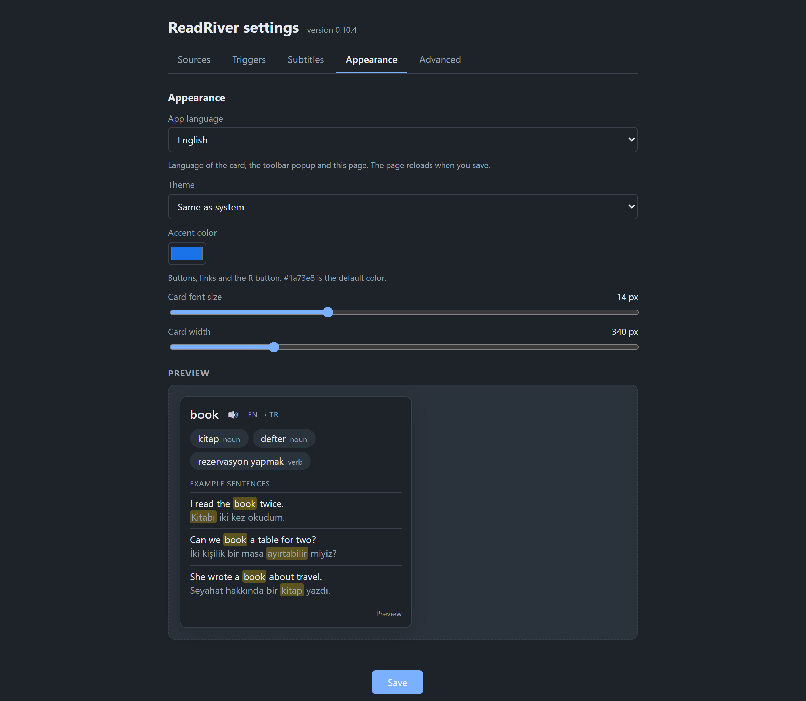

<a id="readme-top"></a>

<div align="center">
  

  <h1>ReadRiver</h1>

  <p>
    <strong>Translate words, sentences and video subtitles without leaving the page.</strong><br>
    Save what you want to learn and review it with flashcards. Free sources out of the box, your own LLM if you want more.
  </p>

  <p>
    
    
    
    
    <a href="LICENSE"></a>
  </p>

  <p>
    <a href="#-quick-start">🚀 Quick start</a>
    ·
    <a href="#-features">✨ Features</a>
    ·
    <a href="#-supported-providers-and-models">🤖 Providers</a>
    ·
    <a href="#-screenshots">🖼️ Screenshots</a>
    ·
    <a href="#-privacy">🔒 Privacy</a>
  </p>

  <p>
    <strong>English</strong> | <a href="README.tr.md">Türkçe</a>
  </p>
</div>

<br>



## Why ReadRiver?

Reading in a foreign language breaks down every time you leave the page to look a word up. ReadRiver answers on the spot, in the page, and remembers the words worth keeping.

- 🖱️ **Translate in place**: double-click a word, select a sentence, hover a subtitle or use the right-click menu.
- 🏷️ **One-click mode**: click words while you read and their translations stay above them as small labels.
- 🎬 **Video subtitles**: hover YouTube, Netflix, video.js and native HTML5 subtitles.
- 🆓 **Works with no key**: Google Translate, MyMemory and Tatoeba example sentences are ready the moment you install.
- 🤖 **Bring your own LLM**: 18 provider presets (Gemini, Claude, OpenAI, Groq, Ollama, …) with automatic fallback.
- 🧠 **Remember what you learn**: save words and review them with Leitner flashcards.
- 🌍 **46 languages**, interface in English or Turkish.
- 🔒 **Private by design**: no server of ours, no telemetry, keys stay in your browser.
- 🧩 **Plain JavaScript**: no build step and no dependencies.

> Status: early development (v0.10.5). Not yet in the Chrome Web Store; install it unpacked as shown below.

## 🚀 Quick start

There is nothing to build.

1. Clone the repository:
   ```bash
   git clone https://github.com/alitaghiyev/readriver.git
   ```
2. Open `chrome://extensions` (or `brave://extensions`) and turn on **Developer mode**.
3. Click **Load unpacked** and select the project folder.
4. Open any page and **double-click a word**.

That's it. The free sources need no key. To add an LLM, open the popup (`Alt+R`) → **Settings** → **Sources** → **+ Add provider**.

| Shortcut | Action |
|---|---|
| `Alt+R` | Open the ReadRiver popup |
| `Alt+T` | Toggle one-click mode in the current tab |
| `Esc` | Close the card; if none is open, remove one-click labels |

`Alt+R` and `Alt+T` can be changed at `chrome://extensions/shortcuts`.

## 🖼️ Screenshots

### One-click mode

Press `Alt+T`, then click words as you read. The translation sits right above each word and stays there; the ☆ saves the word together with the sentence it appeared in.



### Video subtitles

Hover a word in the subtitles to translate it. The video pauses while the card is open and resumes when you move away.


<sub>Video: <a href="https://durian.blender.org">Sintel</a>, © copyright Blender Foundation, licensed under <a href="https://creativecommons.org/licenses/by/3.0/">CC BY 3.0</a>.</sub>

### Toolbar popup and flashcards

<table>
  <tr>
    <td width="50%" valign="top"></td>
    <td width="50%" valign="top"></td>
  </tr>
  <tr>
    <td align="center"><strong>Translate</strong>: look up a word or sentence, hear it, save it</td>
    <td align="center"><strong>Review</strong>: Leitner flashcards for your saved words</td>
  </tr>
</table>

### Providers

An ordered chain with automatic fallback. Each provider has its own model, backup models, a **Test** button and a **⚡ Speed test**.



### Provider gallery

**+ Add provider** opens a gallery grouped by what it costs you: no key, free tier, local, paid.

<p align="center">
  
</p>

### Appearance

Theme, accent color, card font size and width, with a live preview.



## 🤖 Supported providers and models

ReadRiver tries the providers in your list from top to bottom and moves on when one fails, is disabled or is not configured. The fast provider answers first; **🤖 Elaborate with LLM** on the card asks an LLM for a richer answer with meanings, notes and examples.

### Translation sources (no LLM)

These make up the built-in **Fast (free)** provider.

| Source | Role | Key |
|---|---|---|
| **Google Translate** | Main translation, parts of speech, language detection | Not needed (optional Google Cloud key switches to the official API) |
| **DeepL** | Backup translation | Optional (free or pro key) |
| **Microsoft Azure Translator** | Backup translation | Optional |
| **MyMemory** | Last-resort backup | Not needed |
| **Tatoeba** | Example sentences, loaded after the translation | Not needed |
| **Chrome built-in translator** | On-device fallback when everything else fails | Not needed (where Chrome provides it) |

### LLM providers

| Provider | Tier | API | Suggested models |
|---|---|---|---|
| **Gemini** | Free tier | Gemini | `gemini-flash-lite-latest` (default), `gemini-flash-latest` |
| **Groq** | Free tier | OpenAI-compatible | `llama-3.3-70b-versatile` (default), `llama-3.1-8b-instant`, `openai/gpt-oss-120b` |
| **Cerebras** | Free tier | OpenAI-compatible | `llama3.1-8b` (default), `gpt-oss-120b`, `qwen-3-235b-a22b-instruct-2507` |
| **Mistral** | Free tier | OpenAI-compatible | `mistral-small-latest` (default), `mistral-medium-latest`, `mistral-large-latest` |
| **OpenRouter** | Free models | OpenAI-compatible | `meta-llama/llama-3.3-70b-instruct:free`, `google/gemma-3-27b-it:free`, `deepseek/deepseek-chat-v3-0324:free` |
| **GitHub Models** | Free tier | OpenAI-compatible | `openai/gpt-4.1-mini` (default), `openai/gpt-4o-mini`, `meta/Llama-3.3-70B-Instruct` |
| **Cloudflare Workers AI** | Free tier | OpenAI-compatible | `@cf/meta/llama-3.1-8b-instruct` (default), `@cf/meta/llama-3.3-70b-instruct-fp8-fast` |
| **Hugging Face** | Monthly credit | OpenAI-compatible | `meta-llama/Llama-3.3-70B-Instruct` (default), `Qwen/Qwen2.5-72B-Instruct` |
| **NVIDIA NIM** | Free tier | OpenAI-compatible | Pick with **Fetch models** + **⚡ Speed test** (many listed models are slow) |
| **SambaNova** | Trial credit | OpenAI-compatible | `Meta-Llama-3.3-70B-Instruct` (default), `DeepSeek-V3-0324` |
| **Ollama** | Local | OpenAI-compatible | `qwen2.5:7b`, `llama3.1:8b`, `gemma3:4b` |
| **LM Studio** | Local | OpenAI-compatible | Whatever model you have loaded |
| **OmniRoute** | Your own server | OpenAI-compatible | `auto/fast`, `auto`, or any combo |
| **OpenAI** | Paid | OpenAI | `gpt-4.1-mini`, `gpt-4o-mini`, `gpt-4.1-nano` |
| **Claude** | Paid | Anthropic | `claude-haiku-4-5-20251001` (default), `claude-sonnet-5-5` |
| **DeepSeek** | Paid, very cheap | OpenAI-compatible | `deepseek-chat` |
| **Together AI** | Paid | OpenAI-compatible | Pick with **Fetch models** |
| **Custom** | Anything | OpenAI-compatible | Any endpoint that serves `/v1/chat/completions` |

The model names are suggestions shown in the settings page; any model the provider offers can be typed in or picked from **Fetch models**. Free-tier limits belong to the providers and change over time.

**Per-provider tools**

- **Model fallback chain**: a main model plus backup models, tried in order.
- **Fetch models**: lists what your key can actually use.
- **⚡ Speed test**: sends a short request to each model, measures the response time and can pick the fastest ones.
- **Test**: checks the key and model with a real request.
- **Quota & balance**: reads the real remaining quota for DeepL, OpenRouter and DeepSeek.

## ✨ Features

### Card mode (always on)
- **Double-click** a word to open the translation card. An optional delay keeps triple-click paragraph selection from triggering it.
- **Select text**: a small **R** button appears next to the selection, or the selection is translated automatically after a short delay. Can be turned off.
- **Right-click menu**: "Translate" on any selection.
- **Modifier key** (optional): translate only while Alt / Ctrl / Shift is held.
- **Filters**: min/max character count, ignore selections without letters, skip text fields, per-site block list.
- Works on sites that use `user-select: none` or put text inside buttons, and inside iframes.

### One-click mode (`Alt+T`)
- Turned on per tab with `Alt+T` or the switch in the popup; it turns off when the page reloads.
- The word under the mouse is highlighted; click it and the translation appears as a label right above the word.
- Labels stay on the page until you click the word again or press `Esc`.
- Double-click still opens the full card; links, buttons, text fields and drag-selection behave as usual.
- Label placement: *fit between the lines*, *open space between the lines* or *overlay the line above*. Colors, font size and click delay are configurable.

### Translation card
- Word, direction (e.g. `EN → TR`), several translations with part of speech, LLM notes and example sentences.
- 🔊 Pronunciation for the word and each translation, with optional auto-read.
- ☆ Save the word with its translation and an example sentence.
- Rendered inside a closed Shadow DOM, so page CSS cannot break it.

### Video subtitles
- Hover **YouTube / Netflix / video.js** subtitles to translate them. The video can pause while the card is open and resume when you move away.
- Native HTML5 `<video><track>` subtitles are redrawn in an overlay so each word can be hovered. Font size and background opacity are adjustable.

### Toolbar popup (`Alt+R`)
- **Translate**, **History** (recent translations from the cache), **Saved** and **Review** (Leitner flashcards: cards move between boxes and come back when due).
- **Tab health**: if the extension was reloaded while a page was open, the icon shows a red `!` and the popup offers **Reset** to re-inject the scripts without reloading the page.

### Settings and maintenance
- **Persistent cache** with a configurable size.
- **Usage counter**: requests, errors, characters and tokens per source, per day, for the last 90 days.
- **Backup**: export and import settings, providers and saved words as JSON. API keys are left out unless you choose to include them.
- **Diagnostics**: background worker, reachability of each source, whether the content script runs on the current page, last translation.

## 🌍 Languages

Source and target languages are selectable and can be swapped with ⇄; the direction is detected from the text.

English, Turkish, Azerbaijani, German, French, Spanish, Italian, Portuguese, Dutch, Russian, Ukrainian, Polish, Czech, Swedish, Norwegian, Danish, Finnish, Greek, Hungarian, Romanian, Bulgarian, Serbian, Croatian, Bosnian, Albanian, Georgian, Armenian, Kazakh, Uzbek, Kurdish (Kurmanji), Arabic, Persian, Urdu, Hebrew, Hindi, Bengali, Chinese (Simplified), Chinese (Traditional), Japanese, Korean, Vietnamese, Thai, Indonesian, Malay, Latin and Esperanto.

Interface language: **English** or **Türkçe** (or follow the browser).

## 🔒 Privacy

- Translated text is sent **only** to the sources you have enabled: the Google Translate endpoint, Tatoeba, MyMemory, DeepL / Azure, or the LLM you chose.
- No telemetry and no server of our own.
- API keys are stored only in `chrome.storage.local`. Web pages and content scripts never see them.
- With a local provider (Ollama, LM Studio) the text you elaborate with the LLM never leaves your computer.

Full text: [Privacy Policy](PRIVACY.md).

## 🛠️ Development

After changing code, click the reload icon (⟳) on the extension **and refresh open tabs**, since content scripts are injected on page load. The settings page shows the loaded version.

For local development you can seed default keys: copy `local-config.example.json` to `local-config.json` and fill it in. That file is optional and **git-ignored; never commit it**.

Store package: `git archive --format=zip -o readriver.zip HEAD` (see `docs/store-listing.md`).

```
manifest.json
background.js        Service worker: messages (translate, examples, save, …), context menu, shortcuts, tab health
settings.js          Provider list + preferences, migrations
prompt.js            LLM prompt + JSON parsing
cache.js             Persistent translation cache
usage.js, quota.js   Usage counter, quota queries
providers/           free (Google/DeepL/Azure/MyMemory/Tatoeba), gemini, anthropic, openai-compat
shared/              prefs.js (preferences), langs.js (languages), i18n*.js (UI strings), render.js (card), result.css (themes)
content/content.js   In-page behavior: selection, double-click, one-click mode, subtitles, card
popup/               Toolbar popup: search, history, saved words, flashcards
options/             Settings page
docs/screenshots/    Images used in this README
```

## ⚠️ Known limitations

- The free tier uses the unofficial Google `gtx` endpoint; it may be rate-limited.
- Does not run on `chrome://` pages or the Chrome Web Store.
- Inside very small iframes the card can be clipped.
- Tatoeba example sentences are not available for every language pair.

## 🗺️ Roadmap

- [ ] Chrome Web Store / Firefox release
- [ ] Automated tests
- [ ] Anki export of saved words

## 🤝 Contributing

Issues and pull requests are welcome. The code is plain JavaScript with no build step. Translations of the interface into new languages are welcome too.

## 📄 License

Released under the [MIT License](LICENSE).

<p align="right"><a href="#readme-top">↑ Back to top</a></p>
